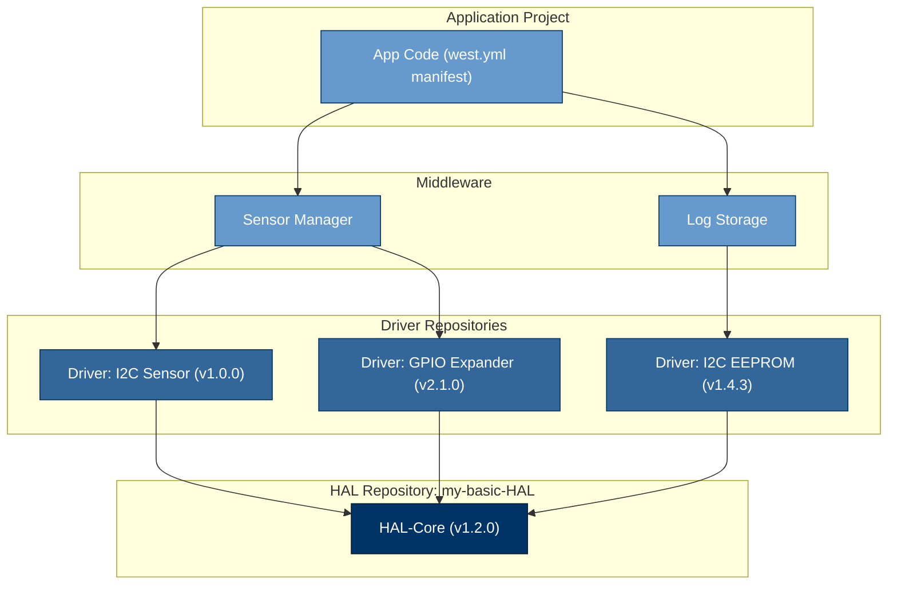

# my-basic-HAL
Hi, I made this repo to have a simple hardware abstraction layer for my projects. I often
find myself writing a complex driver that depends on some peripheral, and it's very hard to
unit-test it because either the SDK or HAL from the manufacturer are not designed for it. Also, it will allow me
to reuse drivers across different platforms.

## Architecture Idea
This HAL is based on the idea that both the HAL and each individual driver that depends on it should have separate and isolated versioning. This approach is greatly facilitated by using a meta-tool like [West](https://docs.zephyrproject.org/latest/guides/west/index.html), which allows managing multiple Git repositories (like the HAL, individual drivers, and your application code) as part of a single, cohesive project.

Here's how this architecture generally works to ensure version compatibility and modularity:

1.  **Independent Repositories:** `my-basic-HAL` is maintained as its own Git repository. Similarly, each individual driver (e.g., an I2C sensor driver, a GPIO expander driver) is also developed and versioned in its own separate Git repository.
2.  **Versioned Driver Dependencies:** Each driver repository will declare its dependency on a *specific version* (e.g., a Git tag like `v1.0.0` or a particular commit hash) of the `my-basic-HAL`. This allows different drivers to depend on different, yet known, versions of the HAL if necessary.
3.  **Project Integration with West:** Application projects (e.g., the firmware for a specific embedded board) contain a `west.yml` manifest file. This file lists all the repositories required for it – the application code, specific drivers intended to use, and `my-basic-HAL` itself. When `west update` is run, West reads this manifest and clones/updates all specified repositories to their exact required versions, ensuring that all components are compatible and correctly assembled in the workspace.

A project could then graphically be seen like this:

## Versioning
Despite what I said, my idea is to keep versioning: [Semantic Versioning](https://semver.org/):

- **Major**: API-breaking changes
- **Minor**: Backwards-compatible features
- **Patch**: Bug fixes

My idea is to retain compatibility towards the drivers built on-top of this HAL.

## Design Principles
I've found that it's not possible to define a HAL that encompases everything, and the
ones that try to, are very complex and big, which is not something I want.

My goals are:
- Basic interfaces applicable for most cases.
- Specialized interfaces for niche cases.
- The configuration of peripherals exposed publicly is only the one that's applicable
for practically all cases.
- The interfaces don't take parameters like "bus number" or "channel", they take pointers
to what I've named as "context".
- In my projects I usually have one more layer on top of the "HAL", which is in charge of:
  - Holding the configuration of all peripherals.
  - Initializing the peripherals of the whole board.
  - Providing methods to update configuration.
  This HAL is designed taking this idea into account.

Finally, there are some design choices that I don't know if I will keep or expand. One of those
is using macros to "enable" or "disable" functionalities/properties. While it's useful in some cases,
because it gives flexibility, it's also cumbersome to have to define a set of macros and variables
for each HAL implementation. I will experiment first, and then decide.

### Basic and Simple interfaces for General Use
If we take for example I2C, I've found in my experience that most of the drivers
or interaction with I2C devices I had were simple. All I needed was to be able
to read and write bytes to a specific address, or write and read bytes at once
(Command-like device).
So methods that just do that are declared.

### Specialized interfaces for Niche cases
Continuing with the I2C example, I've also found that in some specific cases
you can find devices that require more fine-grained control over each I2C transaction.
For example, the CAT23M01 skips ACK when reading consecutive bytes, or skips the STOP condition
after writing the Memory Address. For these cases, there will be a specialized interface that
offers low level control.

### Publicly exposed Configuration
As I mentioned before, the configuration of peripherals exposed publicly is only the one that's applicable
for practically all cases. This is because I don't want consumers of the HAL having to initialize data
that they will not use.
For the peripherals that I couldn't come up with a basic and common configuration, I will forward-declare
the configuration as a struct, and then each HAL implementation will have to provide its
actual definition.

### Peripheral's Context
What I've named here as "context", it's basically a struct that should hold:
- Something that uniquely identifies the peripheral, and instance if applicable. Example:
  - For GPIOs, could be port and pin number.
  - For I2C, could be the bus ID/number and slave address.
- Some other specific data that is required at runtime. Example:
  - In RTOS peripheral interaction, I would include a pointer to a mutex. Which will
  be the same for all the drivers that use the same bus as a Master. This way even if
  many drivers act as I2C masters over the same bus, the HAL implementation ensures that
  they all operate without conflicting with each other.

## Final
For now that's all. I will add more details along as I move forward.
